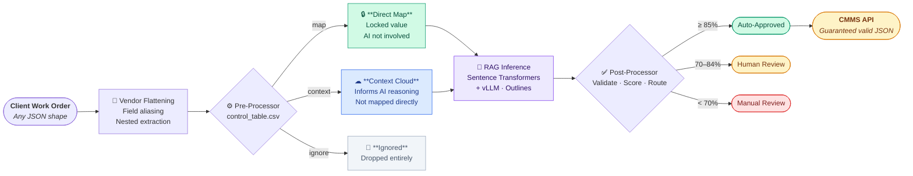

<div align="center">

# CMMS NLP Pipeline

**Translate any client work order format into your CMMS — automatically.**


</div>

---

Real-world CMMS platforms send wildly different payloads. IBM Maximo uses `WPLABOR.CRAFT`. Brightly uses `Labours[0].Craft`. UpKeep uses `category`. Your business team shouldn't have to care.

The CMMS NLP Pipeline is a three-layer adapter — the **Logic Sandwich** — that normalises any client work order JSON into a locked internal schema. Business users configure field handling through a web interface. The AI fills in what rules can't.

<br>

## How It Works



<br>

## The Three Layers

| Layer | File | What it does |
|-------|------|-------------|
| **Pre-Processor** | `pre_processor.py` | Reads `control_table.csv` — classifies every field as MAP, CONTEXT, or IGNORE. High-priority rules bypass the AI entirely. |
| **RAG Inference** | `rag_pipeline.py` | Embeds the work order, retrieves the closest historical tickets, and runs constrained generation via vLLM + Outlines — guaranteeing valid output at the token level. |
| **Post-Processor** | `post_processor.py` | Validates against Pydantic schema, overlays hard-mapped fields, computes confidence score, routes to auto / review / manual. |

<br>

## Quick Start

### Prerequisites

- Python 3.11+
- GPU recommended for RAG mode (CPU works with mock engine)

### Run the web app

```bash
# Windows — double-click or:
launch_app.bat

# macOS
./launch.command

# Direct
pip install -r requirements.txt
uvicorn app:app --reload --port 8000
```

Browser opens at **[http://localhost:8000](http://localhost:8000)** automatically.

### Run tests

```bash
python test_pipeline.py
```

### Use the pipeline directly

```python
from pipeline import CMMSPipeline
from schemas import ClientWorkOrder

pipe = CMMSPipeline(engine_mode="mock", vendor="maximo")

result = pipe.run(ClientWorkOrder(
    client_name="Bedford Plant",
    extra_fields={
        "DESCRIPTION": "Compressor grinding on rooftop unit",
        "ASSETNUM": "RTU-4",
        "WORKTYPE": "CM",
        "WPLABOR": {"CRAFT": "mechanic"},
        "WOPRIORITY": 2,
        "SITEID": "BEDFORD",
    }
))

print(f"Trade:      {result.mapping.trade_id.value}")
print(f"Equipment:  {result.mapping.equipment_id.value}")
print(f"Confidence: {result.confidence_score:.0%}")
print(f"Routing:    {'Auto' if not result.requires_review else 'Review'}")
```

<br>

## The Web App

Three pages, zero JavaScript frameworks.

### 🗂 Field Mapping Studio &nbsp;`/studio`

Paste any client JSON payload. Click **Analyze**. For each detected field, assign it to one of three zones:

| Zone | What it means |
|------|--------------|
| 🔒 **Direct Map** | Lock a specific client value to a CMMS field — the AI is never consulted for this field. Supports glob patterns (`RTU-*`). |
| ☁ **Context Cloud** | Pass the field to the AI as reasoning material. Helps it make smarter inferences about other fields. |
| 🚫 **Ignore** | Drop the field before the pipeline runs. |

Rules save to SQLite, sync to `control_table.csv`, and hot-reload the pipeline — no server restart needed. Selecting a vendor profile flattens nested payloads first, so you configure rules against canonical field names.

---

### ▶ Work Order Simulator &nbsp;`/simulator`

Run any work order through the live pipeline and see exactly what happened:

```
┌─ Pipeline Result ─────────────────────────────── Confidence: 87% ✅ Auto-Approved ┐
│                                                                                   │
│  🔒 Direct Mappings (locked before AI)                                           │
│     trade_code = MECH  →  trade_id: TRD_001_HVAC                                │
│     equipment_tag = RTU-4  →  equipment_id: EQP_99_RTU                           │
│                                                                                   │
│  ☁  Context Cloud (AI reasoning material)                                        │
│     [work_desc: compressor grinding]  [building: HQ]  [priority: P2]            │
│                                                                                   │
│  🚫 Ignored Fields                                                                │
│     requested_by   cost_center                                                    │
│                                                                                   │
│  📋 Final CMMS Mapping                                                            │
│     trade_id          TRD_001_HVAC   (locked)                                    │
│     equipment_id      EQP_99_RTU     (locked)                                    │
│     problem_type_id   TYP_MECHANICAL (AI inferred)                               │
│     problem_code_id   CODE_COMPRESSOR_FAIL (AI inferred)                         │
└───────────────────────────────────────────────────────────────────────────────────┘
```

Four presets are included: HVAC compressor failure, sink overflow, electrical fault, and IBM Maximo format.

---

### 📋 Rules Manager &nbsp;`/rules`

View all `control_table.csv` rules, grouped by strategy. Filter by client or strategy. Delete with one click. Add new rules with cascading CMMS field → value dropdowns.

<br>

## Supported CMMS Platforms

| Platform | Field style | Nested path example | Custom fields |
|----------|------------|---------------------|---------------|
| **IBM Maximo** | `ALL_CAPS` | `WPLABOR.CRAFT`, `WPLABOR[*].CRAFT` | — |
| **Fiix** (Rockwell) | `camelCase` | `tasks[0].description`, `tasks[*].description` | ✓ `customFields[*]` |
| **UpKeep** | `camelCase` | `formItems[*]` | ✓ `customFields[*]` |
| **Brightly Asset Essentials** | `PascalCase` | `Labours[0].Craft`, `Scheduling.TargetCompletion` | — |
| **Any flat JSON** | any | — | — |

Adding a new vendor takes one JSON file in `vendor_profiles/`. Use `vendor_profiles/_template.json` as a starting point.

<br>

## Output Schema

The pipeline always produces exactly these four fields. The LLM is constrained to valid enum values at the token level — invalid output is impossible.

| Field | Valid values |
|-------|-------------|
| `trade_id` | `TRD_001_HVAC` · `TRD_002_PLMB` · `TRD_003_ELEC` |
| `equipment_id` | `EQP_99_RTU` · `EQP_88_CHLR` · `EQP_77_BLR` · `EQP_11_SINK` · `EQP_00_UNK` |
| `problem_type_id` | `TYP_MECHANICAL` · `TYP_CLOG` · `TYP_ELEC_FAULT` |
| `problem_code_id` | `CODE_COMPRESSOR_FAIL` · `CODE_EMERGENCY_OVERFLOW` · `CODE_POWER_LOSS` |

To extend the schema, add entries to the enums in `schemas.py`. No retraining required — the RAG dataset and constrained decoder update automatically.

<br>

## Configuration

### Control Table Rules

`control_table.csv` is the business rules source of truth. The web app writes to it automatically, but it's plain CSV — edit it directly if you prefer.

```
client_name  │ source_field   │ source_value │ target_field  │ target_value     │ strategy │ priority
─────────────┼────────────────┼──────────────┼───────────────┼──────────────────┼──────────┼─────────
*            │ craft          │ mechanic     │ trade_id      │ TRD_001_HVAC     │ map      │ 10
*            │ craft          │ plumber      │ trade_id      │ TRD_002_PLMB     │ map      │ 10
ACME Corp    │ equipment_tag  │ RTU-*        │ equipment_id  │ EQP_99_RTU       │ map      │ 10
*            │ priority       │ *            │               │                  │ context  │ 8
*            │ building       │ *            │               │                  │ context  │ 5
*            │ requested_by   │ *            │               │                  │ ignore   │ 0
```

- `*` in `client_name` matches all clients
- `*` and glob patterns (`RTU-*`) work in `source_value`
- Higher `priority` wins when multiple rules match the same field
- `map` rules must have `target_field` and `target_value`
- `context` and `ignore` rules leave those columns empty

### Inference Engine

```python
# Mock engine — no GPU, keyword-based (for development/CI)
pipe = CMMSPipeline(engine_mode="mock")

# RAG engine — requires GPU, Sentence Transformers + vLLM + Outlines
pipe = CMMSPipeline(engine_mode="rag")
```

<details>
<summary><strong>RAG engine dependencies (GPU required)</strong></summary>

```bash
pip install vllm>=0.6.0 outlines>=0.1.0
```

Supported base models: `Qwen/Qwen2.5-7B-Instruct`, `mistralai/Mistral-7B-Instruct-v0.3`

The embedding model (`all-MiniLM-L6-v2`) runs on CPU — only the generation step needs a GPU.

</details>

<br>

## Project Structure

```
NLP Pipeline CMMS/
├── app.py                  # FastAPI web app (Field Mapping Studio, Simulator, Rules Manager)
├── db.py                   # SQLite persistence layer
├── pipeline.py             # Orchestrator — wires all three layers
├── pre_processor.py        # Layer 1: control table classification (map/context/ignore)
├── prompt_builder.py       # Layer 2a: dynamic prompt construction
├── rag_pipeline.py         # Layer 2b: RAG engine + MockRAGEngine
├── post_processor.py       # Layer 3: validation, confidence scoring, routing
├── schemas.py              # Pydantic schemas — enums, ClientWorkOrder, PipelineResult
├── vendor_profile.py       # Vendor profile loader + nested path extraction
│
├── vendor_profiles/        # One JSON file per supported CMMS platform
│   ├── maximo.json
│   ├── fiix.json
│   ├── upkeep.json
│   ├── brightly.json
│   └── _template.json
│
├── templates/              # Jinja2 HTML templates (HTMX-powered)
│   ├── base.html
│   ├── studio.html
│   ├── simulator.html
│   └── rules.html
│
├── static/
│   └── style.css
│
├── control_table.csv       # Business rules — edit directly or via Rules Manager
├── dataset.jsonl           # RAG retrieval examples (15 starter tickets)
├── test_pipeline.py        # End-to-end smoke tests
├── requirements.txt
├── launch_app.bat          # Windows launcher
└── launch.command          # macOS launcher
```

<br>

## Version History

| Version | What changed |
|---------|-------------|
| **v1.4.0** | FastAPI + HTMX web app: Field Mapping Studio, Work Order Simulator, Rules Manager. SQLite persistence, CSV sync, pipeline hot-reload. |
| **v1.3.0** | RAG architecture: Sentence Transformers retrieval + vLLM + Outlines constrained generation. Removed fine-tuning dependency. |
| **v1.2.0** | Vendor profile system: field aliasing, nested path extraction (`WPLABOR.CRAFT`, `Labours[*].Craft`), custom field auto-discovery. |
| **v1.1.0** | Dynamic `ClientWorkOrder` schema. Three-bucket classification (map / context / ignore). Glob pattern matching. |
| **v1.0.0** | Initial Logic Sandwich: pre-processor, LLM inference, post-processor, Streamlit dashboard. |
